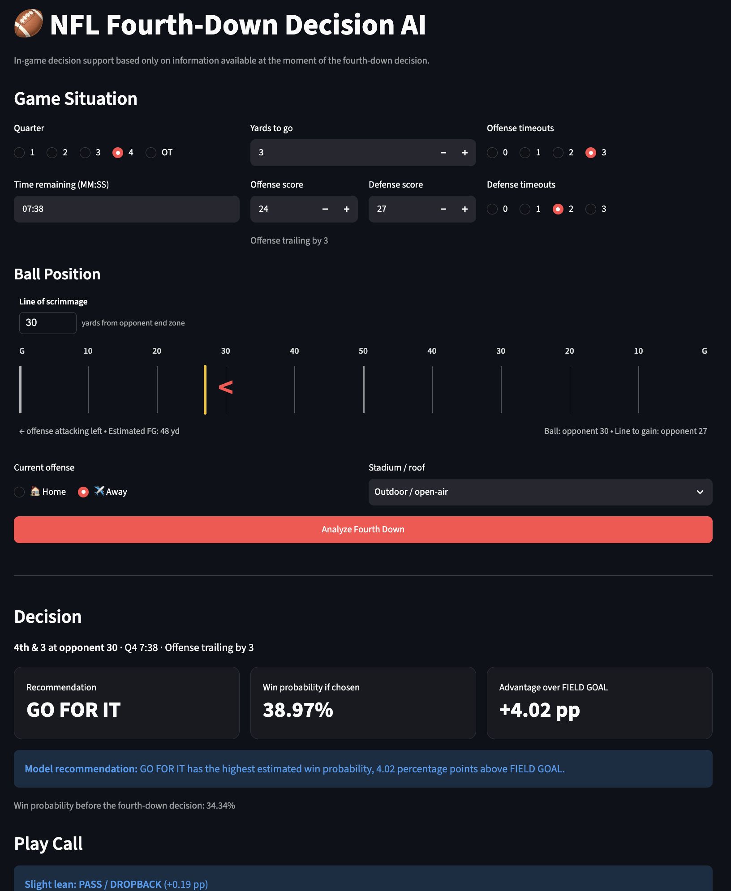

# Fourth Down AI

An NFL fourth-down decision engine that compares **go for it, field goal, and punt** decisions using machine learning, empirical transition models, and Monte Carlo simulation.

The project supports both regulation and 2025+ NFL regular-season overtime situations and includes an interactive Streamlit interface.

## Live Demo

[Launch the NFL Fourth-Down Decision AI](https://fourth-down-ai.streamlit.app/)

## Demo



## Features

- Compares go-for-it, field-goal, and punt decisions
- Separately evaluates run and pass attempts
- Estimates downstream win probability / game value
- Models field-goal outcomes and post-kick transitions
- Models punt field position and rare punt outcomes
- Uses empirical fourth-down transition pools
- Supports regular-season overtime:
  - Opening possession
  - Response possession
  - Sudden death
  - 10-minute overtime period
  - 2 timeouts per team
  - Tie value at expiration
- Interactive Streamlit app

## How It Works

The decision engine combines several components:

1. **Fourth-down conversion modeling**
   - Estimates conversion probability
   - Separately evaluates run and pass attempts

2. **Field-goal modeling**
   - Estimates made, missed, blocked, and other outcomes
   - Simulates resulting possession, field position, and clock state

3. **Punt modeling**
   - Estimates resulting field position
   - Includes ordinary and rare punt outcomes

4. **Win-probability modeling**
   - Estimates the value of resulting game states

5. **Monte Carlo simulation**
   - Simulates possible outcomes for each available action
   - Recommends the highest-value decision

## Overtime Support

The engine supports 2025+ NFL regular-season overtime decision states.

It distinguishes among:

- **Opening possession**
- **Response possession**
- **Sudden death**

Overtime logic handles possession requirements, terminal scoring events, clock expiration, and tied-game value.

The overtime implementation was tested with:

- 12 direct rule-layer checks
- 1,330 valid overtime states
- 27 timeout combinations
- 144 regulation regression states
- Held-out 2025 regular-season overtime plays

Final audit results:

```text
HARD FAILURES: 0
REVIEW FLAGS: 0
Regulation mismatches: 0
```

## Interactive App

Run the Streamlit interface locally:

```bash
streamlit run app.py
```

The app allows you to specify:

- Down and distance
- Field position
- Score differential
- Quarter / overtime phase
- Game clock
- Home or away possession
- Offensive and defensive timeouts
- Stadium / roof context

It then displays the estimated value of each available fourth-down option and recommends the highest-value action.

## Installation

Clone the repository:

```bash
git clone git@github.com:daniel-jpg/fourth-down-ai.git
cd fourth-down-ai
```

Create and activate a virtual environment:

```bash
python -m venv .venv
source .venv/bin/activate
```

Install dependencies:

```bash
pip install -r requirements.txt
```

Run the app:

```bash
streamlit run app.py
```

## Project Structure

```text
fourth-down-ai/
├── app.py
├── requirements.txt
├── assets/
│   └── fourth-down-ai-demo.png
├── data/
├── models/
└── src/
    ├── 01_build_fourth_down_dataset.py
    ├── ...
    ├── 39_build_punt_model.py
    ├── 40_build_fake_models.py
    ├── 41_train_win_probability_model.py
    ├── 42_build_decision_engine.py
    ├── 43_evaluate_2025.py
    ├── 45_build_overtime_state_dataset.py
    └── 46_audit_overtime_engine.py
```

The numbered scripts document the modeling, auditing, and validation pipeline used to build the final engine.

## Main Components

### Decision Engine

`src/42_build_decision_engine.py`

Loads the trained models and empirical transition pools, simulates each available action, and calculates its expected value.

### Web App

`app.py`

Streamlit interface for entering a game situation and viewing the recommended fourth-down decision.

### Overtime Audit

`src/46_audit_overtime_engine.py`

Tests overtime rules, state validity, timeout combinations, held-out overtime plays, and regulation behavior.

## Data and Models

The repository contains the trained models and transition artifacts required to run the decision engine.

Large intermediate datasets, virtual environments, local development files, and temporary audit outputs are intentionally excluded through `.gitignore`.

## Tech Stack

- Python
- Streamlit
- NumPy
- pandas
- Polars
- scikit-learn
- XGBoost
- Altair
- nflreadpy
- PyArrow
- joblib

## Limitations

- This is a decision-support research model, not a causal guarantee of the optimal football decision.
- Postseason overtime is not separately modeled.
- Monte Carlo standard error reflects simulation noise, not total model uncertainty.
- Kicker-specific context defaults to the development-data median unless supplied programmatically.
- Fake punt and fake field-goal recommendations are experimental.

## Status

Currently supports:

- Regulation fourth-down decisions
- 2025+ NFL regular-season overtime rules

Regular-season and postseason overtime are modeled separately under their respective timing and continuation rules.